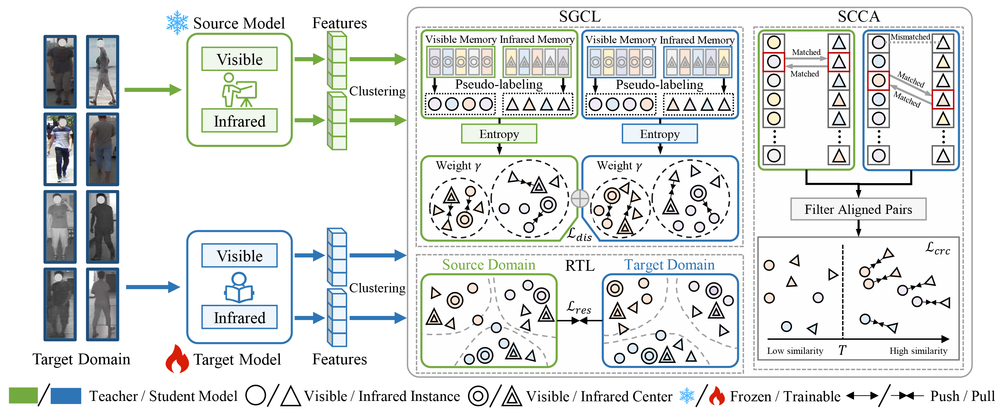

# KFGOD

Yongxiang Li, Yanglin Feng, Yuan Sun, Dezhong Peng, Xi Peng, **Peng Hu**, Learning Source-free Domain Adaptation for
Visible-Infrared Person Re-Identification, NeurIPS, 2025.

## Abstract
In this paper, we investigate source-free domain adaptation (SFDA) for visible-infrared person re-identification (VI-ReID), aiming to adapt a pre-trained source model to an unlabeled target domain without access to source data or target annotations. To address this challenging setting, we propose a novel learning paradigm, termed Source-Free Visible-Infrared Person Re-Identification (SVIP), which fully exploits the prior knowledge embedded in the source model to guide target domain adaptation. The proposed framework comprises three key components specifically designed for the source-free scenario: 1) a Source-Guided Contrastive Learning (SGCL) module, which leverages the discriminative feature space of the frozen source model as a reference to perform contrastive learning on the unlabeled target data, thereby preserving discrimination without requiring source samples; 2) a Residual Transfer Learning (RTL) module, which learns residual mappings to adapt the target model’s representations while maintaining the structural knowledge from the source model; and 3) a Structural Consistency-Guided Cross-modal Alignment (SCCA) module, which enforces reciprocal structural constraints between visible and infrared modalities to identify reliable cross-modal pairs and achieve robust modality alignment without source supervision. Extensive experiments on benchmark datasets demonstrate that SVIP substantially enhances target domain performance and outperforms existing unsupervised VI-ReID methods under source-free settings.

## Framework

## Note
The code will be coming soon.
