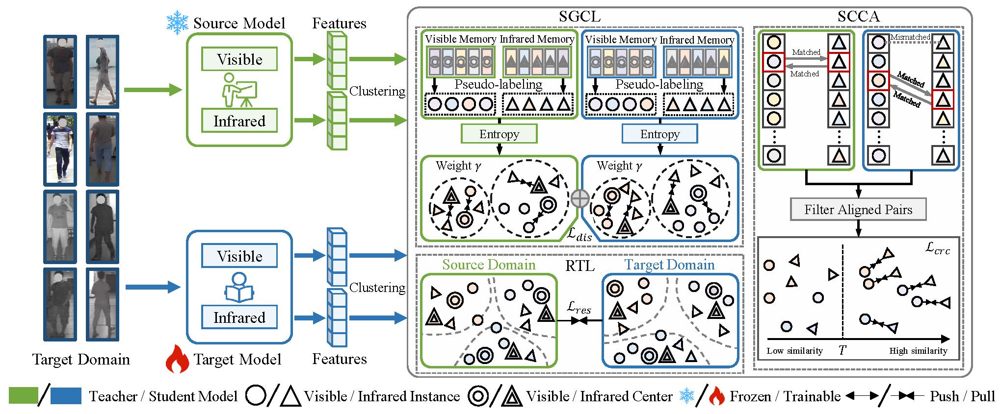

This is the official code implementation of "Learning Source-free Domain Adaptation for Visible-Infrared Person Re-Identification", accepted by NeurIPS 2025.

## Requirements
- python 3.8.13
- torch 1.8.0
- torchvision 0.9.0
- scikit-learn 1.2.2

## Quick Start 
In the following instructions, we take the transfer setting SYSU-MM01 → RegDB as a typical example.
### Dataset Preprocessing
Please change the dataset path to your own path in the `prepare_regdb.py`.
```shell
python prepare_regdb.py
```

### Source Model
Put your source model trained on SYSU-MM01 into `./pretrained` and name it `resnet50-sysumm01.pth`.

### Training
```shell
bash run_train_regdb.sh
```

### Testing
```shell
bash test_regdb.sh
```

## Generate Data for Weather Setting
To evaluate under the weather degradation setting, generate the required traget domain data with the following command. The example images in `./data_corruptions/examples` will be transformed and saved to `./data_corruptions/examples_results`.
```shell
python make_corrupt.py
```

## Citation
If our work is helpful for your research, please consider citing:
```
@inproceedings{li2025learning,
  title={Learning Source-Free Domain Adaptation for Visible-Infrared Person Re-Identification},
  author={Li, Yongxiang and Feng, Yanglin and Sun, Yuan and Peng, Dezhong and Peng, Xi and Hu, Peng},
  booktitle={The Thirty-ninth Annual Conference on Neural Information Processing Systems (NeurIPS)},
  year={2025}
}